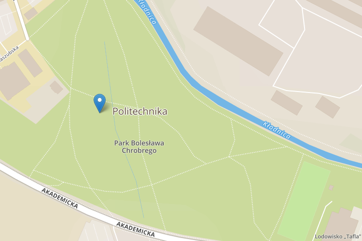
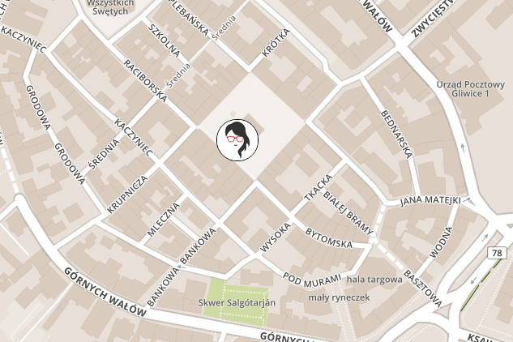
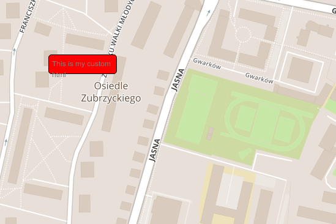
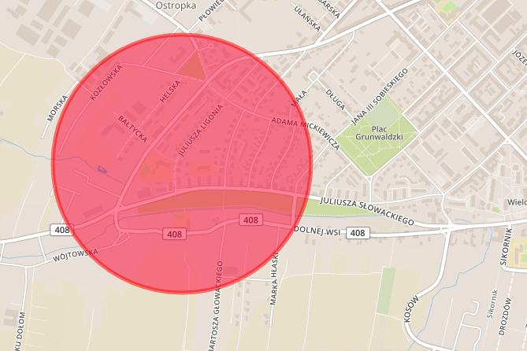
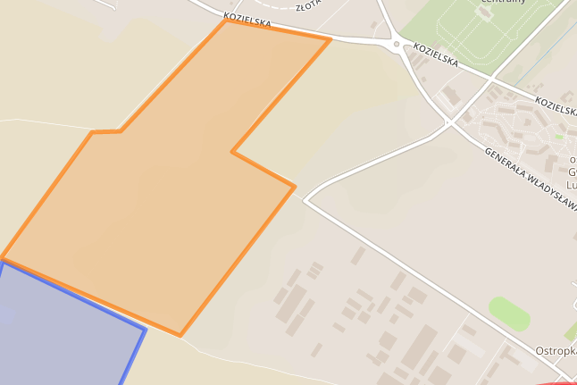
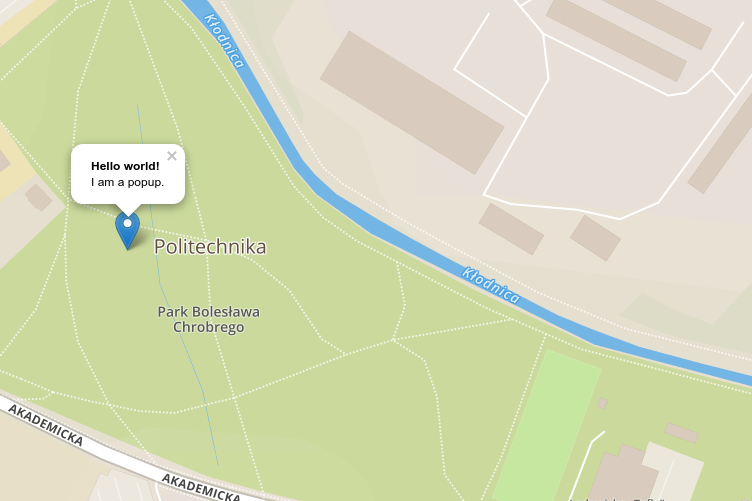
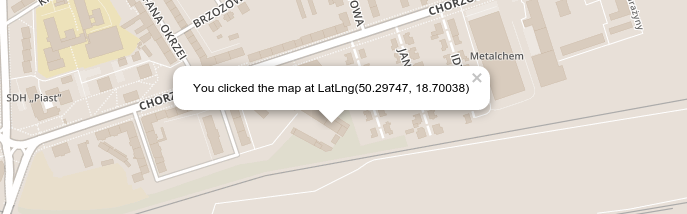

class: center, middle

.large-image[]
# Introduction to maps

???

- open-source JavaScript library for mobile-friendly interactive maps
- can be extended with lots of plug-in
- well-documented API

---

class: center, middle, inverse

# Step 1 - Prepare environment

---

class: middle

# Step 1 - Prepare environment

- Ruby on Rails
- Coffee Script
- [Leaflet](http://leafletjs.com/) - as gem [https://rails-assets.org/](https://rails-assets.org/)
- [OpenStreetMap](http://openstreetmap.org)
- [Mapbox](https://www.mapbox.com/) - generates tiles
- Maps tiles:

#### Mapbox
```ruby
https://api.tiles.mapbox.com/v4/{id}/{z}/{x}/{y}.png?access_token=#{access_token}
```

#### Open Street Map
```ruby
http://{s}.tile.osm.org/{z}/{x}/{y}.png
```

???

- .strong[Tiles] - square bitmap graphics displayed in a grid arrangement to show a map, tiled map data
- .strong[Tile set] - typically includes enough tiles to form a very large image
- display a particular area of the map on a website and show also several zoom levels
- .strong[How to do this?] - is really nice shows on leaflet website

---

class: center, middle, inverse

# Step 2 - Initialization of map

---

class: middle

# Step 2 - Initialization of map

```html
<!-- index.html -->
<div id='map'></div>
```

```coffee
# index.coffee
jQuery ->
  map = L.map('map').setView([50.301, 18.654], 13)

  L.tileLayer('https://api.tiles.mapbox.com/v4/{id}/{z}/{x}/{y}.png?'+
  'access_token={accessToken}',
    {
      attribution: "#{copyright_and_licence}",
      maxZoom: 18,
      id: "#{your_id}",
      accessToken: "#{your_access_token}"
    }
  ).addTo(map);
```

---

class: middle, inverse, center

# Step 3 - Just fun

---

class: middle, inverse, center

# Markers

---

class: middle

# Marker

```coffee
marker = L.marker([50.28895538456755, 18.681907653808594]).addTo(map)
```

.small-image[]

???

- remember to put leaflet images in specific direction
- two types of coordination system .strong[Cartesian coordinate geometry] and .strong[Lat-long system]
- .strong[X] - as longitude, .strong[Y] - as latitude (opposite to regular Lat-long notation)
- Leaflet - Lat-long notation
- GeoJSON - Cartesian notation
- .strong[Example:] 52.23N, 4.97E in GeoJSON, you need to pass [4.97599, 52.23943]

---

# Custom marker

```coffee
customIcon = L.icon(
  iconUrl: 'assets/womanonrails.jpg'
  iconSize:     [50, 50]
  iconAnchor:   [25, 25]
  className: 'round'
)

customMarker = L.marker(
  [50.29391802001304, 18.665471076965332],
  icon: customIcon
).addTo(map)
```

.small-image[]

???

- you can change also shadow for icon
- size you can also change in CSS
- .strong[iconAnchor] - set please on image where point is connect to image
- you can add class with styles
---

# HTML marker

```coffee
divIcon = L.divIcon(
  className: 'div-icon'
  html: '<div>This is my custom html</div>'
  iconSize: [100, 20]
)

L.marker([50.2845132498121, 18.668603897094727], icon: divIcon).addTo(map)
```

.small-image[]

???

- you can add HTML
- change size in CSS

---

class: middle, inverse, center

# Shapes

---

# Circle

```coffee
circle = L.circle(
  [50.290024725454515, 18.640880584716797], 500,
  color: 'red',
  fillColor: '#f03',
  fillOpacity: 0.5
).addTo(map)

```

.small-image[]

---

# Polygon

```coffee
polygon = L.polygon([
  [50.29830444909283, 18.61384391784668],
  [50.29619353058144, 18.620710372924805],
  [50.29084727901576, 18.616890907287598],
  [50.29125855046426, 18.61354351043701],
  [50.2941373510724,  18.611998558044434],
  [50.29830444909283, 18.61384391784668]
]).addTo(map)
```

.small-image[]

???

- starts and ends with the same point
- you can also do line

---

class: middle, inverse, center

# Others

---

# Popups

```coffee
marker.bindPopup("<b>Hello world!</b><br>I am a popup.").openPopup()
circle.bindPopup("I am a circle.")
polygon.bindPopup("I am a polygon.")

```

```coffee
popup = L.popup()
  .setLatLng([51.5, -0.09])
  .setContent("I am a standalone popup.")
  .openOn(map)
```

.small-image[]

???

- only one can be open in the same time
- can be open already or after click
- can be add without any object

---

# Events

```coffee
onMapClick = (e) -> console.log "Coordinate: #{e.latlng}"
map.on('click', onMapClick)
```

#### On click show popup
```coffee
onMapClick = (e) ->
  popup = L.popup()
  popup.setLatLng(e.latlng)
  popup.setContent("You clicked the map at #{e.latlng}")
  popup.openOn(map);
  console.log "Coordinate: #{e.latlng}"

map.on('click', onMapClick)
```

.small-image[]

---

class: inverse, middle, center

# GeoJSON

---

# GeoJSON

```coffee
geoData = {
  "type": "Feature",
  "properties": {},
  "geometry": {
    "type": "Polygon",
    "coordinates": [[
      [18.613758087158203, 50.298386690775416],
      [18.618135452270508, 50.3022518894775],
      [18.619508743286133, 50.302279301112605],
      [18.62457275390625, 50.30570563109659],
      [18.62959384918213, 50.30510261491786],
      [18.624873161315918, 50.3016488295082],
      [18.627877235412598, 50.3005797498622],
      [18.622384071350098, 50.29600162425392],
      [18.613758087158203, 50.298386690775416]
    ]]
  }
}

style = {
  "color": "#ff7800",
  "weight": 5,
  "opacity": 0.65
}

L.geoJson(geoData, style: style).addTo(map)
```

???

- interpret geoJSON data
- you can add style
- you can add properties to geoJSON to set style as function
- .strong["properties": {"party": "Republican"}]
- you can add shapes, markers .strong[pointToLayer]
- .strong[onEachFeature] - call something on shape for example bind popup events .strong[bindPopup]
- filters for data in properties

---

# Summary

#### Tiles:
- [Open Street Map](http://www.openstreetmap.org/)
- [Bing maps](http://www.microsoft.com/maps/)
- [Google Maps](https://www.google.pl/maps?source=tldso)


- [Mapbox](https://www.mapbox.com/)
- [MapTiler](http://www.maptiler.com/)
- [Maps Stamen](http://maps.stamen.com/)
- [Map Quest](http://www.mapquest.com/)

#### JS Library:
- [Leaflet](http://leafletjs.com/)
- [OpenLayers](http://openlayers.org/)
- [Google Maps Javascript API](https://developers.google.com/maps/documentation/javascript/?csw=1)
- [Modest Maps](https://github.com/modestmaps/modestmaps-js)

---

class: middle, inverse

# Bibliography

- [Leaflet](http://leafletjs.com/)
- [OpenStreetMap](http://openstreetmap.org)
- [Mapbox](https://www.mapbox.com/)
- [Rails Assets](https://rails-assets.org/)
- [Tiles](http://wiki.openstreetmap.org/wiki/Tiles)
- [GeoJSON](http://geojson.io/)
- [Leaflet Routing Machine](http://www.liedman.net/leaflet-routing-machine/)
- [Leaflet Draw](https://github.com/Leaflet/Leaflet.draw)

---

class: middle, center

.small-image[]
### Agnieszka Matysek
[@womanonrails](https://twitter.com/womanonrails)

amatysek&#064;fractalsoft&#046;org
